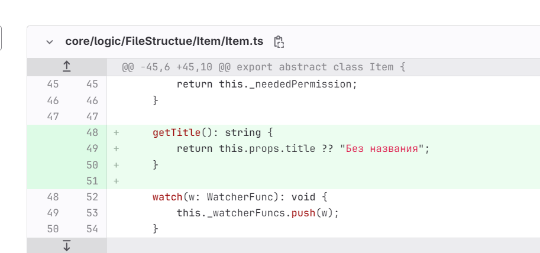

-  спросить у Стаса насчёт замечания Саши «Когда мы уже дадим возможность комментировать текст с применённым форматированием?»

-  потестить «Что за ошибка, кстати, будет если я локально создал ветку и удалённо на сервере создал ветку с таким же названием. И хочу запуллить или запушить изменения.»

-  Разбить прогресс клона на этапы

-  Обсудить с Катей: если открыть статью с конфликтом, то предлагать решить её в модалке

-  В dev версии в mdt в категории с архивом версий все статьи 404

-  Подумать над локализацией

   

-  Не делать “restoreRepositoryState” при автоматическом пуше при синхронизации

-  Исправить баг в github <https://github.com/Gram-ax/gramax/issues/2>

-  Добавить e2e для табов

-  Посмотреть логи mdt у Олеси (ссылка на саппорт - <https://support.ics-it.ru/issue/GXS-1665>, ссылка на логи - <https://dev.gram.ax/gitlab.ics-it.ru/olesya.andreeva/new-catalog33/master/-/11>)

-  Посмотреть логи у Саши М (на рабочем столе json файл) и у Петра (в мессенджере)

-  После пуша новой статьи в правой навигации всё ещё старые состояния и показывает, что статья новая, хотя была добавлена.

-  Посмотреть баг Саши М.:

   Статья: Добавление источника

   Суть ошибки: Он изменил контент файла там, где конфликта вообще не было. Он изменил строчку выше, а строчки ниже, которые были удалены в каком-то коммите на сервере, он не трогал, однако всё равно вылез конфликт.

-  Замечания от Саши М.:

   -  sellout + долго грузит публикацию изменений

   -  не абортится запрос на git status при закрытии модалки «Публикация изменений». После закрытия, спустя время, всё равно показывается модалка «Нет изменений»

-  После мерж конфликта левая навигация не обновляется

-  Если добавить на сервере файл и локально файл, то libgit2 не триггернёт ошибку конфликта, однако контент будет конфликтом. Должны быть именно такие изменения или примерно такие:

   ```
   --- 
   order: 8 
   title: abc
   --- 
   
   LOCAL CHANGE
   ```

   ```
   --- 
   order: 8 
   title: abc
   --- 
   
   ORIGIN CHANGE
   ```

-  После решения конфликта не обновляется навигация (нужно catalog’ом подписываться на изменения baseMergeConflictResolver)

-  В десктопном приложении отваливается с ошибкой, есть конфликты

-  Если мержить с удалением ветки, то надо удалять ветку только после решения конфилкта, т.к. чел может отменить мерж