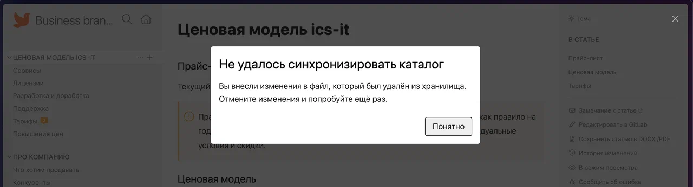

-  спросить у Стаса насчёт замечания Саши «Когда мы уже дадим возможность комментировать текст с применённым форматированием?»

-  потестить «Что за ошибка, кстати, будет если я локально создал ветку и удалённо на сервере создал ветку с таким же названием. И хочу запуллить или запушить изменения.»

-  при открытии каталога через ctrl+лкм бесконечно загружается каталог

-  добавить US на замечание Саши, что непонятно, когда открывается хранилище, что делать. (При переходе по ссылке каталог пытается склонироваться без sourceData)

-  Сгенерировать .d.ts файлы и выложить их в npm

-  Проанализировать wasm

-  Переделать эпик про Плагины

-  Красиво рендерить json в ошибках

-  Возвращаться к той же статье и те же окна после обновления приложения

-  Посмотреть замечание Саши

   

-  Посмореть что происходит в каталоге jnj, откатить 100 коммитов назад

-  Разбить прогресс клона на этапы

-  Обсудить с Катей: если открыть статью с конфликтом, то предлагать решить её в модалке

-  После обновления приложения была ошибка “…/Gramax-docs/docs…” не был найден

-  В dev версии в mdt в категории с архивом версий все статьи 404

-  Подумать над локализацией

   

-  Не делать “restoreRepositoryState” при автоматическом пуше при синхронизации

-  После добавления github хранилища (возможно и с gitlab так же), всё ещё вылазит модалка “Вы не подключены к хранилищу”

-  Починить открытие текущей статьи в публикации  изменений (при условии, что в публикации изменений есть текущая статья)

-  Спросить у Стаса, почему не переименовываются ресурсы при переименовании раздела, но при переименовании статьи они переименовываются

-  Не переключается сразу с `master` на `master-test` в каталоге “for_notes”, нужно обновлять страницу

-  Исправить баг в github <https://github.com/Gram-ax/gramax/issues/2>